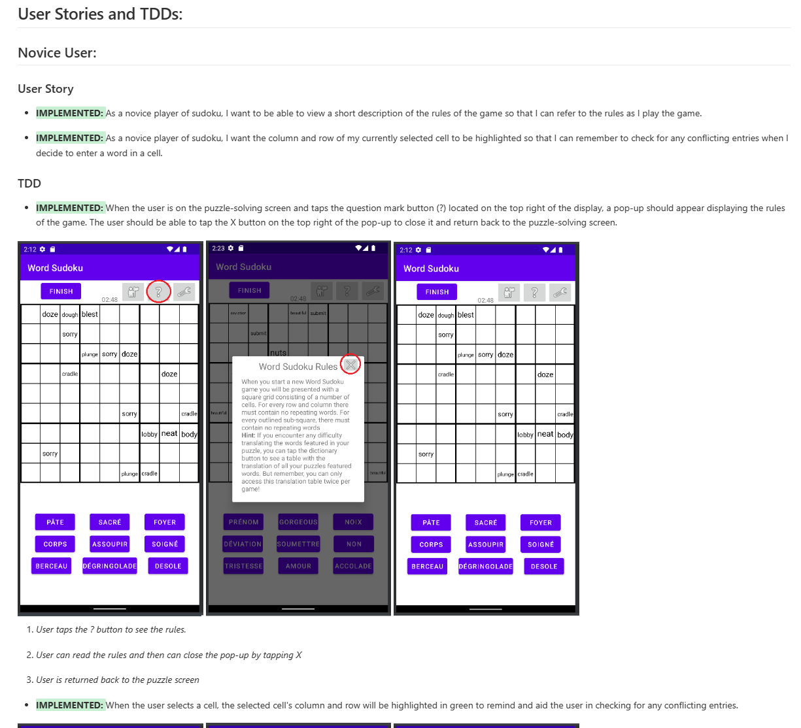

# Introduction


Word Sudoku is an interactive twist on the classic Sudoku puzzle that is suitable for users of all ages who wish to learn a new language or improve their vocabulary. It supports devices of any screen size and runs offline. Currently, we support 5 languages (English, French, Spanish, Chinese, and Arabic). Although, French and English are the main supported languages.
<br>

Some of the unique features of Word Sudoku include but are not limited to:

- Timing games
- Five levels of difficulty for sudoku games (Beginner, Novice, Intermediate, Advanced, Expert)
- A very large database of words (1000+)
- Listening Comprehension Mode
- Support of French UI
- Minimal and user-friendly design
- Text-to-speech mode for the visually impaired and those who wish to improve their oral comprehension

# APK Release

To download an apk file for installing the app on:   [Wsudoku APK](https://csil-git1.cs.surrey.sfu.ca/ska387/cmpt276-1231-d2-echo/-/raw/master/app-resources/com.echo.wsudoku.apk)

# Requirements Document

The requirements document is by far the most important document for any software project.

<b>{+To view our Requirements document (which includes the changes we made over each iteration), please head over to: +}</b> ```Requirements.md```
<br>
<b>[Or, CLICK HERE for a direct link to Requirements.md to view all our User stories and TDDs](./Requirments.md)</b>
<br>


A high level overview:<br><br><br>


# Documentation

This page contains a high level description of the code structure and the design of the application.
For a full description of each of the classes and their methods check ```Documentation.md```:
[View our documentation](./Documentation.md)
<br>
A high level overview:<br><br><br>


# GamePlay

Some screenshots of the game:<br><br><br>


